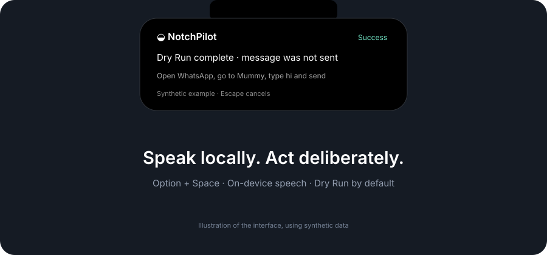

# NotchPilot

Native, local voice control from the MacBook notch area. An independent macOS 26 project using selected, modified Laya components under Apache-2.0. Not affiliated with Laya, Convai Innovations, or Apple.



Version **0.1.0** is being verified. Do not treat the current acceptance status as a completed release until the checks in `docs/ACCEPTANCE.md` are filled in.

## Setup

Requires Apple Silicon, macOS 26, Xcode 26+ (including accepted license), Python 3.11+, Git and GitHub CLI. No Xcode project needs to be opened.

```bash
./scripts/bootstrap.sh
./scripts/run.sh
```

Setup creates `.venv`, installs pinned dependencies, downloads one optional Laya checkpoint into Application Support, and installs a local `.app` in `~/Applications/NotchPilot.app`. Approve **Microphone** and **Accessibility** in Setup, then prepare the local speech assets. Screen Recording is not needed. `./scripts/bootstrap.sh --skip-model` builds deterministic control without model downloads.

Press **Option + Space** to listen. Press it again, or **Escape**, to cancel and stop the microphone. The shortcut is configurable. Hold-to-talk is optional. Each session has a 60-second limit.

Say:

- “Open Safari.”
- “Open WhatsApp, go to Mummy, type hi and send.”
- “Open WhatsApp, go to Mummy, type hi.” — leaves a draft.

**Dry Run is on by default.** It opens the exact conversation and enters the draft, but does not send. Map a spoken alias to an exact display name in Settings. An ambiguous recipient is rejected. In live mode, Send requires an explicit trailing instruction in the recognizer's committed text. Sensitive messages require confirmation. Cancellation cannot retract a message already handed to WhatsApp.

## Supported scope

Launch/focus WhatsApp, Safari, Notes, Finder, Calendar, Music, Calculator and System Settings. The first messaging adapter targets native WhatsApp for macOS with semantic Accessibility controls. This release uses an English command grammar with Apple on-device speech language assets. Dictated text is preserved, including case and punctuation supplied by recognition.

Unknown actions fail safely. General file manipulation, arbitrary clicking, deletion, financial actions, media/volume control, public posting, unrestricted plans and cloud AI are not implemented. UI automation may need updates when WhatsApp changes. A missing/incomplete Accessibility tree is an error, not a reason to guess coordinates.

## Local by design

No audio retention, transcript uploads, telemetry or automatic crash uploads. Transcripts expire from memory. Aliases stay in local preferences. Diagnostics record action categories and timings, never recipients or messages. Laya uses one offline checkpoint through private pipes; deterministic commands do not wait for it. Its current fallback abstains because the small synthetic validation set did not meet the confidence gate. See [privacy](PRIVACY.md), [security](SECURITY.md), and [model evaluation](docs/MODELS.md).

## Development

```bash
./scripts/build.sh       # release .app; build/NotchPilot.app points to it
./scripts/test.sh        # native and Python tests; no real messages
./scripts/lint.sh        # formatting and repository checks
./scripts/benchmark.sh   # sequential local CPU/MPS benchmarks and native harness
./scripts/package.sh     # verified ad-hoc local ZIP; not notarized
```

Native builds are staged outside synced Documents folders to avoid Finder metadata interfering with code signing. After setup, the Finder-launchable app is installed in `~/Applications/NotchPilot.app` and linked from `build/NotchPilot.app`. Keep the source and `.venv` in place for the optional Python sidecar. See [permissions](docs/PERMISSIONS.md) for development-build permission resets.

[Architecture](docs/ARCHITECTURE.md) · [Performance](docs/PERFORMANCE.md) · [Adding an adapter](docs/ADDING_AN_APP_ADAPTER.md) · [Contributing](CONTRIBUTING.md) · [Third-party notices](THIRD_PARTY_NOTICES.md)

## Roadmap

- Broader sanitized WhatsApp-version fixtures and localization coverage.
- More supported application adapters with verified APIs and tests.
- Independently labeled data and held-out validation before enabling optional model decisions.
- Reproducible signed/notarized distribution when a maintainer authorizes Apple Developer credentials.

No roadmap item is a claim of current support.
