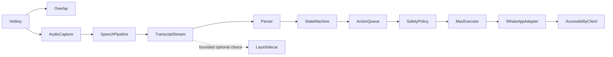

# Architecture

NotchPilot is a Swift Package containing `NotchPilotCore` and the native `NotchPilotApp` executable, packaged as an AppKit menu-bar application. SwiftUI supplies the overlay content and settings forms. No web renderer is used.

`NotchOverlay` derives the camera-housing gap from public NSScreen safe-area and auxiliary rectangles. It renders below the housing without obscuring the menu bar. A nonactivating, mouse-transparent panel joins Spaces and supports fullscreen alongside other apps. Ordinary screens receive a top-center capsule. There is no hidden display timer.

`HotkeyManager` registers a Carbon EventHotKey (a public native API). Escape is registered only during active sessions. The UI is shown synchronously before speech preparation. User preferences are local UserDefaults.

`AudioCapture` owns AVAudioEngine on a serial queue. A tap copies borrowed PCM buffers; conversion and metering happen on the capture queue. `SpeechPipeline` is an actor using SpeechAnalyzer and SpeechTranscriber with fast and volatile results. It preheats installed assets without opening the microphone. There is no remote or SFSpeech cloud fallback.

`StreamingCommandParser` preserves dictation as an opaque string, except a terminal explicit connector-plus-send clause. It recognizes open/launch/focus, go to, type/say, send, cancel, and natural conjunctions. `CommandStateMachine` tracks the volatile transcript, recognizer-committed prefix, revisions, and cancellation. A repeated prefix can dispatch reversible clauses before utterance finalization. Send requires the recognizer's finalized prefix.

`ActionQueue` serializes actions while speech continues independently. Stable command identifiers prevent repeated dispatch. Revised drafts replace staged work; a changed already-executed recipient fails closed. A synchronous lock-protected token invalidates queued or obsolete work even while an AX request is waiting. Every side effect checks the token. AX waits are bounded; already delivered actions cannot be undone by cancellation.

`AccessibilityClient` uses AXObserver notifications with bounded fallback waits, per-call messaging timeouts, and depth/node/time-limited searches. It reads roles, semantic labels, identifiers, and explicit target field values. It skips unrelated message tables. The adapter verifies an exact chat header and draft before any send, then requires the composer to clear and a new outgoing bubble to appear. No production coordinate fallback exists.

`LayaDecisionService` runs an isolated Python process over inherited pipes, without a listening socket. It loads one model, serializes inference, constrains requests to fewer than 20 options, and kills obsolete requests. It does not route deterministic commands, produce message text, plan steps, or invoke APIs. Conservative abstention is used until project-specific held-out validation clears the decision gate. The future planner is deliberately absent from 0.1.0.

`Diagnostics` writes a bounded privacy-safe local audit off the UI thread. `PerformanceMonitor` exposes process memory and measured timestamps; benchmark scripts separate native dispatch from third-party launch and recognition latency.
